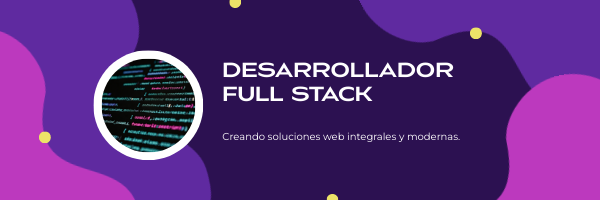

<!-- Banner -->

  

---

### 👋 Hi there, I'm Fernando

I'm a Full Stack Developer with 1.5+ years of experience building applications using Angular, .NET, and SQL Server. Currently, I'm transitioning into React and building projects to showcase my frontend skills.

- 🔭 I’m currently working on a modern ToDo app with React.
- 🌱 Learning Zustand, Tailwind, and advanced hooks.
- 📫 Reach me on [LinkedIn](www.linkedin.com/in/fernandodelacruzramos).
- ⚡ Fun fact: I love building things from scratch!

---

### 🛠️ Tech Stack

